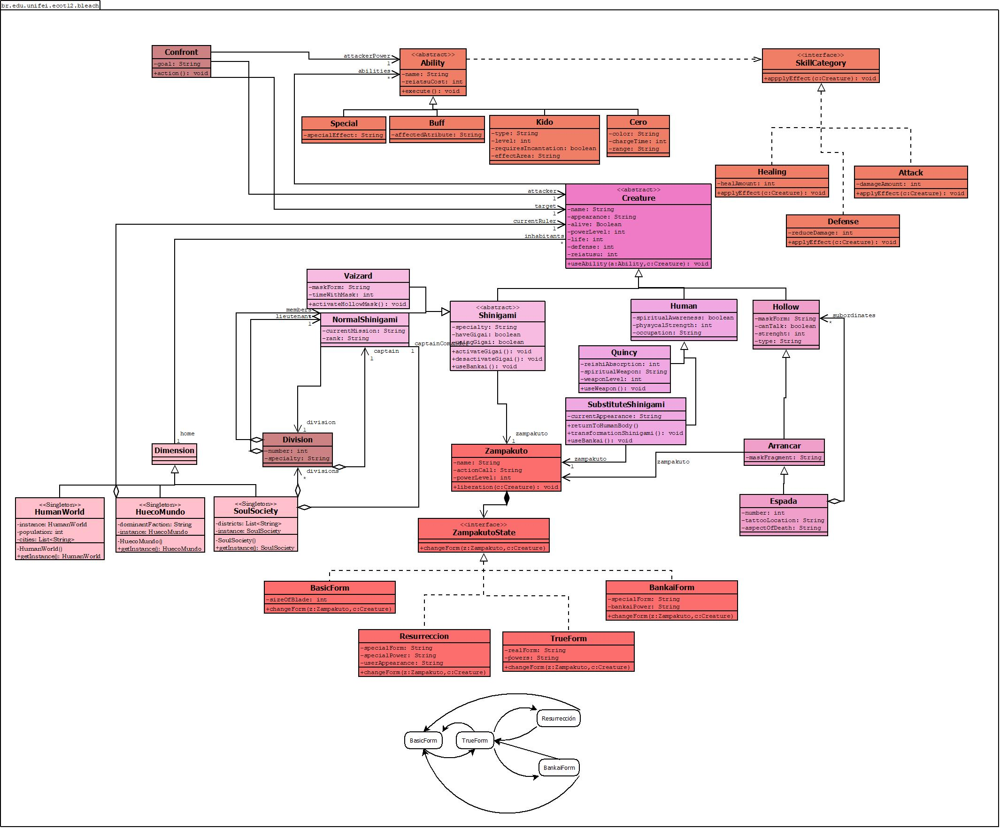

# Bleach - Object-Oriented Programming Simulator



> A comprehensive Java-based simulator of the Bleach anime universe, showcasing object-oriented programming principles and design patterns.


## 📋 Table of Contents

- [Overview](#overview)
- [Features](#features)
- [Prerequisites](#prerequisites)
- [Installation & Build](#installation--build)
- [Usage](#usage)
- [Project Structure](#project-structure)
- [Architecture & Design](#architecture--design)
- [Key Components](#key-components)
- [Contributing](#contributing)
- [License](#license)
- [Acknowledgments](#acknowledgments)

## 🎯 Overview

This project is an educational implementation demonstrating object-oriented design principles through the simulation of the Bleach anime universe. It models character hierarchies, ability systems, and world interactions while maintaining clean, extensible code architecture.

The simulator creates a dynamic environment where various character types coexist across different dimensions, each with unique attributes, abilities, and roles within their respective organizations.

## ✨ Features

- **Multi-Character System**: Implement various character types from the Bleach universe
  - Shinigami
  - Vaizard
  - Arrancar
  - Human
  - Quincy

- **Hierarchical World System**: Multiple dimensional spaces with inhabitants
  - Soul Society
  - Human World
  - Hueco Mundo

- **Comprehensive Ability System**: Various skill categories
  - Kido
  - Zanpakuto
  - Special abilities
  - Healing techniques
  - Stat buffs and modifications

- **Character Attributes**: Realistic stat system
  - Life points, Defense, Reiatsu
  - Power Level, Rank, and Specializations
  - Dynamic ability lists and equipment

- **Organization Structures**: Divisions with captains and ranks
  - Division assignments
  - Rank system within divisions
  - Group management and relationships

## 📋 Prerequisites

- **Java Development Kit (JDK)** 17 or higher
- **Apache Maven** 3.6 or higher

### Build the Project

Using Maven:

```bash
mvn clean install
```

This will compile the source code, run tests, and package the application.

### Compile Only

```bash
mvn clean compile
```

### Run the Application

```bash
mvn exec:java -Dexec.mainClass="br.edu.unifei.ecot12.bleach.Main"
```

Or compile and run directly:

```bash
mvn clean compile
java -cp target/classes br.edu.unifei.ecot12.bleach.Main
```

## 📖 Usage

### Basic Example

The application initializes various character types and demonstrates their interactions:

```java
// Create a Vaizard
Vaizard v1 = new Vaizard();
v1.setName("Shinji Hirako");
v1.setPowerLevel(200);
v1.setDefense(100);

// Assign to Soul Society
SoulSociety sou = SoulSociety.getInstance();
sou.getInhabitants().add(v1);

// Equip with Zanpakuto
Zampakuto z1 = new Zampakuto();
z1.setName("Sakanade");
v1.setZampakuto(z1);

// Activate Hollow mask ability
v1.activateHollowMask();
```

### Running the Main Simulation

Execute the `Main` class to see a full demonstration:

```bash
mvn exec:java -Dexec.mainClass="br.edu.unifei.ecot12.bleach.Main"
```

The output displays:
- Vaizard character stats and transformations
- Normal Shinigami and Division assignments
- Human characters with special abilities
- Quincy character profiles
- Substitute Shinigami capabilities

## 📁 Project Structure

```
ecot12-final-bleach/
├── pom.xml                     # Maven configuration
├── README.md                   
├── Bleach.dia                  # UML diagram (Dia format)
│
└── src/
    ├── main/java/
    │   └── br/edu/unifei/ecot12/bleach/
    │       ├── Main.java                      # Main entry point
    │       ├── Creature.java                  # Base creature abstraction
    │       │
    │       ├── Character Types:
    │       ├── Shinigami.java
    │       ├── NormalShinigami.java
    │       ├── SubstituteShinigami.java
    │       ├── Vaizard.java
    │       ├── Arrancar.java
    │       ├── Hollow.java
    │       ├── Human.java
    │       ├── Quincy.java
    │       │
    │       ├── Ability System:
    │       ├── Ability.java                   # Abstract ability
    │       ├── Kido.java                      
    │       ├── SkillCategory.java
    │       ├── Attack.java
    │       ├── Defense.java
    │       ├── Healing.java
    │       ├── Buff.java
    │       ├── Special.java
    │       │
    │       ├── Equipment:
    │       ├── Zampakuto.java                 
    │       ├── ZampakutoState.java
    │       ├── BankaiForm.java
    │       ├── BasicForm.java
    │       ├── TrueForm.java
    │       ├── Resurreccion.java
    │       ├── Cero.java
    │       │
    │       ├── World System:
    │       ├── Dimension.java                 # Base world/dimension
    │       ├── SoulSociety.java              
    │       ├── HumanWorld.java                
    │       ├── HuecoMundo.java                
    │       │
    │       ├── Organization:
    │       ├── Division.java
    │       ├── Confront.java
    │       └── Arrancar.java
    
```

## 🏗️ Architecture & Design Patterns

The core of this project is the implementation of behavioral and creational design patterns to solve complex domain logic:

* **State Pattern**: Orchestrates the evolution of Zanpakutos (from `BasicForm` to `Bankai` or `Resurreccion`). The transition logic is encapsulated within specific state classes, triggered by the character's power level and race.
* **Strategy Pattern**: Utilized via the `SkillCategory` interface. This allows abilities like `Attack`, `Defense`, and `Healing` to be swapped or assigned dynamically to any `Creature`, decoupling the ability from its specific effect.
* **Singleton Pattern**: Applied to the Dimension classes (`SoulSociety`, `HuecoMundo`, `HumanWorld`). This ensures that each realm maintains a unique, global instance to manage its respective inhabitants.
* **Inheritance & Polymorphism**: A deep hierarchy starting from `Creature` allows for specialized behaviors in `Shinigami`, `Hollow`, and `Quincy` while maintaining a common interface for combat and ability usage.

### Class Hierarchy

```
Creature (abstract)
├── Shinigami (abstract)
│   ├── NormalShinigami
│   ├── Vaizard
│   └── SubstituteShinigami
├── Hollow
│   └── Arrancar
├── Human
├── Quincy
└── ... [other creature types]

Ability (abstract)
├── Attack
├── Defense
├── Healing
├── Special (wrapper)
├── Buff (wrapper)
└── Kido (extends Attack)

Dimension (abstract)
├── SoulSociety
├── HumanWorld
└── HuecoMundo

Zampakuto (abstract)
├── BasicForm
├── BankaiForm
└── TrueForm
```

## 🔑 Key Components

### Creature

The abstract base class representing all characters in the simulation. Provides core attributes and methods:

- **Attributes**: Life, Defense, Reiatsu, Power Level, Appearance
- **Methods**: `useAbility()`, stat getters/setters
- **Collections**: Abilities list, home dimension

### Ability System

Flexible system allowing characters to learn and use abilities:

- **Kido**: Spiritual energy-based attacks
- **Special**: Unique character abilities
- **Buff**: Stat modifications and enhancements
- **Attack/Defense/Healing**: Specific damage/protection/restoration

### Dimension System

World management using the Singleton pattern:

```java
SoulSociety sou = SoulSociety.getInstance();
HumanWorld hw = HumanWorld.getInstance();
```

### Zanpakuto System

Shinigami weapons with multiple forms and states representing power progression.


## 📄 License

This project is licensed under the MIT License - see the [LICENSE](LICENSE) file for details.

## 👏 Acknowledgments

- Inspired by the Bleach anime series by Tite Kubo
- Developed as an educational project for object-oriented programming
- Part of Software Engineering curriculum at UNIFEI (Federal University of Itajubá)

---
